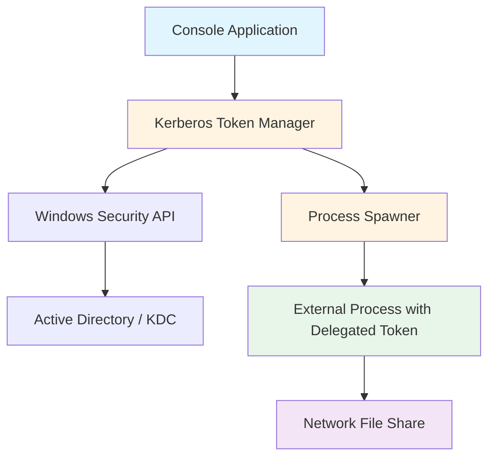
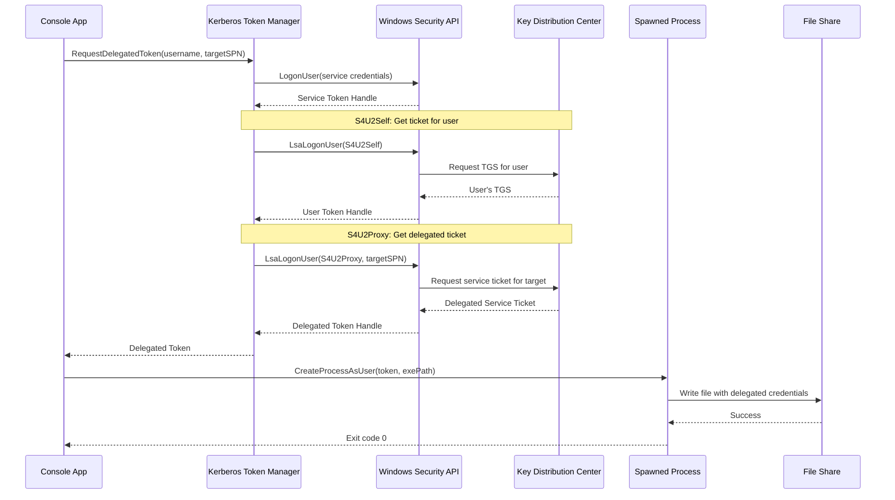
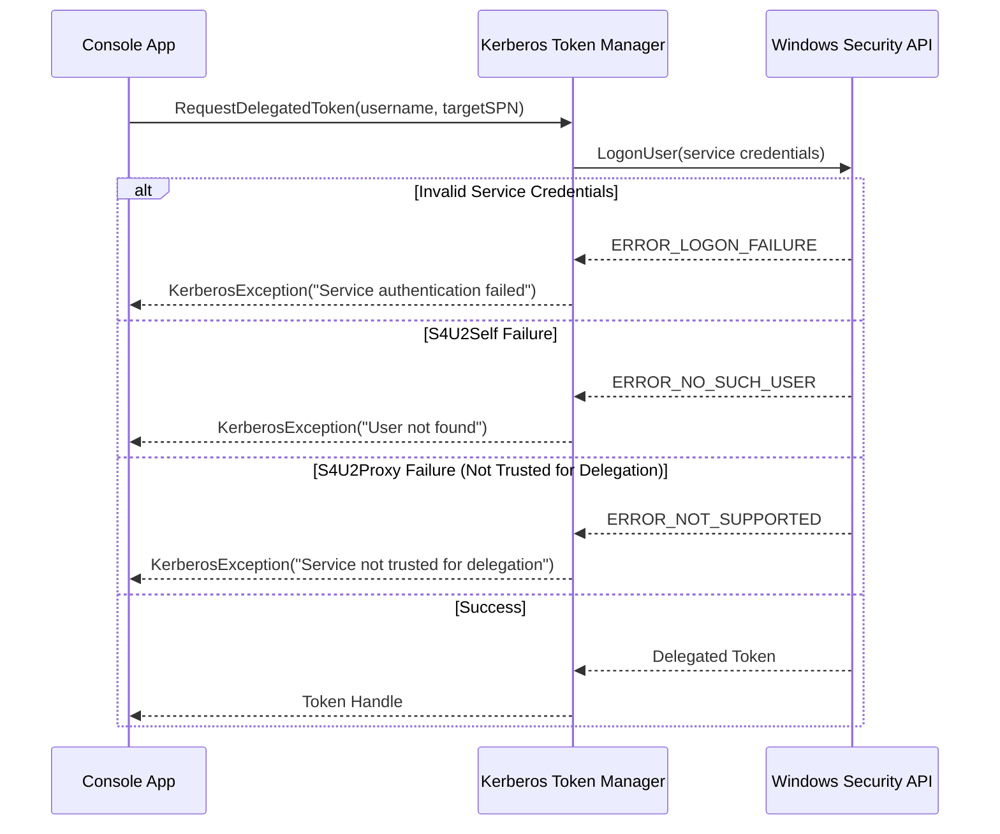

# Design Document: Kerberos Constrained Delegation App

## Overview

This C# console application implements Kerberos constrained delegation to solve the double-hop authentication problem in Windows environments. The application uses S4U2Self (Service for User to Self) and S4U2Proxy (Service for User to Proxy) extensions to obtain a Kerberos service ticket on behalf of a user, then uses that ticket to spawn an external process with delegated credentials. The spawned process demonstrates successful double-hop authentication by writing to a network file share, which requires the delegated credentials to traverse two authentication boundaries: from the client to the service, and from the service to the file share.

The application addresses a common enterprise scenario where a middle-tier service needs to access backend resources (like file shares or databases) using the original user's identity rather than the service's own identity, while maintaining security and auditability.

## Architecture



## Sequence Diagrams

### Main Authentication and Delegation Flow



### Error Handling Flow



## Components and Interfaces

### Component 1: KerberosTokenManager

**Purpose**: Manages the creation and lifecycle of Kerberos tokens using constrained delegation

**Interface**:
```csharp
public interface IKerberosTokenManager : IDisposable
{
    /// <summary>
    /// Obtains a delegated Kerberos token for the specified user and target service
    /// </summary>
    /// <param name="username">User to impersonate (UPN or DOMAIN\username format)</param>
    /// <param name="targetServicePrincipalName">SPN of the target service for delegation</param>
    /// <returns>Windows token handle with delegated credentials</returns>
    SafeAccessTokenHandle GetDelegatedToken(string username, string targetServicePrincipalName);
    
    /// <summary>
    /// Validates that the service account is properly configured for constrained delegation
    /// </summary>
    /// <returns>True if delegation is properly configured</returns>
    bool ValidateDelegationConfiguration();
}
```

**Responsibilities**:
- Authenticate the service account to obtain initial credentials
- Execute S4U2Self to obtain a forwardable ticket for the target user
- Execute S4U2Proxy to obtain a service ticket for the target SPN
- Manage token handles and ensure proper cleanup
- Validate delegation configuration in Active Directory

### Component 2: ProcessSpawner

**Purpose**: Spawns external processes with delegated credentials

**Interface**:
```csharp
public interface IProcessSpawner
{
    /// <summary>
    /// Starts a process with the specified token and arguments
    /// </summary>
    /// <param name="token">Security token to use for the process</param>
    /// <param name="executablePath">Path to the executable</param>
    /// <param name="arguments">Command-line arguments</param>
    /// <param name="timeoutMs">Maximum time to wait for process completion</param>
    /// <returns>Process execution result including exit code and output</returns>
    ProcessExecutionResult SpawnProcessWithToken(
        SafeAccessTokenHandle token,
        string executablePath,
        string arguments,
        int timeoutMs = 30000);
}
```

**Responsibilities**:
- Create process with impersonated credentials using CreateProcessAsUser
- Configure process startup information and security attributes
- Monitor process execution and capture output
- Handle process timeout and cleanup
- Return execution results including exit code and standard output/error

### Component 3: FileShareWriter (External Process)

**Purpose**: Standalone executable that writes to a file share to validate delegation

**Interface**:
```csharp
public interface IFileShareWriter
{
    /// <summary>
    /// Writes test content to a file share using current process credentials
    /// </summary>
    /// <param name="uncPath">UNC path to the file share</param>
    /// <param name="content">Content to write</param>
    /// <returns>True if write succeeded</returns>
    bool WriteToShare(string uncPath, string content);
    
    /// <summary>
    /// Validates that the current process has the expected user identity
    /// </summary>
    /// <returns>Current user identity information</returns>
    UserIdentityInfo GetCurrentIdentity();
}
```

**Responsibilities**:
- Accept UNC path and content as command-line arguments
- Write file to network share using current process credentials
- Log the current user identity for verification
- Return appropriate exit codes (0 for success, non-zero for failure)
- Handle file I/O errors gracefully

### Component 4: ConfigurationManager

**Purpose**: Manages application configuration and validation

**Interface**:
```csharp
public interface IConfigurationManager
{
    /// <summary>
    /// Gets the service account credentials for initial authentication
    /// </summary>
    ServiceAccountCredentials GetServiceCredentials();
    
    /// <summary>
    /// Gets the target user to impersonate
    /// </summary>
    string GetTargetUsername();
    
    /// <summary>
    /// Gets the SPN for the target service
    /// </summary>
    string GetTargetServicePrincipalName();
    
    /// <summary>
    /// Gets the path to the external executable
    /// </summary>
    string GetExternalExecutablePath();
    
    /// <summary>
    /// Gets the UNC path for file share testing
    /// </summary>
    string GetFileSharePath();
    
    /// <summary>
    /// Validates all configuration settings
    /// </summary>
    ValidationResult ValidateConfiguration();
}
```

**Responsibilities**:
- Load configuration from app.config or command-line arguments
- Validate configuration completeness and format
- Provide secure access to sensitive credentials
- Support configuration overrides for testing

## Data Models

### Model 1: ServiceAccountCredentials

```csharp
public sealed class ServiceAccountCredentials
{
    public string Username { get; init; }
    public string Domain { get; init; }
    public SecureString Password { get; init; }
    
    /// <summary>
    /// Gets the fully qualified username (DOMAIN\username)
    /// </summary>
    public string FullyQualifiedUsername => $"{Domain}\\{Username}";
}
```

**Validation Rules**:
- Username must not be null or empty
- Domain must not be null or empty
- Password must not be null and must have length > 0
- Username must not contain invalid characters (\ / : * ? " < > |)

### Model 2: ProcessExecutionResult

```csharp
public sealed class ProcessExecutionResult
{
    public int ExitCode { get; init; }
    public string StandardOutput { get; init; }
    public string StandardError { get; init; }
    public bool TimedOut { get; init; }
    public TimeSpan ExecutionTime { get; init; }
    
    public bool IsSuccess => ExitCode == 0 && !TimedOut;
}
```

**Validation Rules**:
- ExitCode can be any integer value
- StandardOutput and StandardError can be null or empty
- ExecutionTime must be non-negative
- TimedOut is true only if process exceeded timeout limit

### Model 3: UserIdentityInfo

```csharp
public sealed class UserIdentityInfo
{
    public string Username { get; init; }
    public string Domain { get; init; }
    public string AuthenticationType { get; init; }
    public bool IsAuthenticated { get; init; }
    public SecurityIdentifier Sid { get; init; }
    
    public string FullyQualifiedName => $"{Domain}\\{Username}";
}
```

**Validation Rules**:
- Username must not be null or empty when IsAuthenticated is true
- Domain must not be null or empty when IsAuthenticated is true
- Sid must not be null when IsAuthenticated is true
- AuthenticationType should be "Kerberos" for delegated tokens

### Model 4: KerberosException

```csharp
public sealed class KerberosException : Exception
{
    public int Win32ErrorCode { get; init; }
    public KerberosErrorType ErrorType { get; init; }
    
    public KerberosException(string message, int win32ErrorCode, KerberosErrorType errorType)
        : base(message)
    {
        Win32ErrorCode = win32ErrorCode;
        ErrorType = errorType;
    }
}

public enum KerberosErrorType
{
    ServiceAuthenticationFailed,
    UserNotFound,
    DelegationNotConfigured,
    S4U2SelfFailed,
    S4U2ProxyFailed,
    TokenCreationFailed,
    ProcessSpawnFailed
}
```


## Algorithmic Pseudocode

### Main Application Algorithm

```csharp
// Main entry point algorithm
public static int Main(string[] args)
{
    // Preconditions:
    // - Application runs with service account privileges
    // - Service account is configured for constrained delegation in AD
    // - Target user exists in Active Directory
    
    try
    {
        // Step 1: Load and validate configuration
        var config = new ConfigurationManager();
        var validationResult = config.ValidateConfiguration();
        
        if (!validationResult.IsValid)
        {
            Console.WriteLine($"Configuration validation failed: {validationResult.ErrorMessage}");
            return 1;
        }
        
        // Step 2: Initialize Kerberos token manager
        using var tokenManager = new KerberosTokenManager(config.GetServiceCredentials());
        
        // Step 3: Validate delegation configuration
        if (!tokenManager.ValidateDelegationConfiguration())
        {
            Console.WriteLine("Service account is not properly configured for constrained delegation");
            return 2;
        }
        
        // Step 4: Obtain delegated token
        var targetUser = config.GetTargetUsername();
        var targetSpn = config.GetTargetServicePrincipalName();
        
        Console.WriteLine($"Obtaining delegated token for user: {targetUser}");
        Console.WriteLine($"Target SPN: {targetSpn}");
        
        using var delegatedToken = tokenManager.GetDelegatedToken(targetUser, targetSpn);
        
        Console.WriteLine("Successfully obtained delegated token");
        
        // Step 5: Spawn external process with delegated credentials
        var spawner = new ProcessSpawner();
        var exePath = config.GetExternalExecutablePath();
        var fileSharePath = config.GetFileSharePath();
        var arguments = $"\"{fileSharePath}\" \"Test content from delegated process\"";
        
        Console.WriteLine($"Spawning process: {exePath}");
        Console.WriteLine($"Arguments: {arguments}");
        
        var result = spawner.SpawnProcessWithToken(delegatedToken, exePath, arguments);
        
        // Step 6: Report results
        Console.WriteLine($"Process exit code: {result.ExitCode}");
        Console.WriteLine($"Execution time: {result.ExecutionTime.TotalSeconds:F2}s");
        
        if (!string.IsNullOrEmpty(result.StandardOutput))
        {
            Console.WriteLine($"Standard Output:\n{result.StandardOutput}");
        }
        
        if (!string.IsNullOrEmpty(result.StandardError))
        {
            Console.WriteLine($"Standard Error:\n{result.StandardError}");
        }
        
        return result.IsSuccess ? 0 : 3;
    }
    catch (KerberosException ex)
    {
        Console.WriteLine($"Kerberos error: {ex.Message}");
        Console.WriteLine($"Error type: {ex.ErrorType}");
        Console.WriteLine($"Win32 error code: 0x{ex.Win32ErrorCode:X8}");
        return 4;
    }
    catch (Exception ex)
    {
        Console.WriteLine($"Unexpected error: {ex.Message}");
        Console.WriteLine($"Stack trace:\n{ex.StackTrace}");
        return 5;
    }
    
    // Postconditions:
    // - Return 0 if delegation and file write succeeded
    // - Return non-zero error code if any step failed
    // - All resources (tokens, handles) are properly disposed
}
```

**Preconditions:**
- Application runs with service account privileges
- Service account is configured for constrained delegation in Active Directory
- Target user exists in Active Directory
- Configuration is valid and complete

**Postconditions:**
- Returns 0 if delegation and file write succeeded
- Returns non-zero error code if any step failed
- All resources (tokens, handles) are properly disposed
- Console output contains detailed execution information

**Loop Invariants:** N/A (no loops in main algorithm)

### S4U2Self and S4U2Proxy Algorithm

```csharp
public SafeAccessTokenHandle GetDelegatedToken(string username, string targetServicePrincipalName)
{
    // Preconditions:
    // - username is valid UPN or DOMAIN\username format
    // - targetServicePrincipalName is valid SPN format (e.g., "cifs/fileserver.domain.com")
    // - Service account has already authenticated
    // - Service account is trusted for delegation to targetServicePrincipalName
    
    SafeAccessTokenHandle serviceToken = null;
    SafeAccessTokenHandle userToken = null;
    SafeAccessTokenHandle delegatedToken = null;
    
    try
    {
        // Step 1: Authenticate service account to get initial token
        serviceToken = AuthenticateServiceAccount();
        
        if (serviceToken == null || serviceToken.IsInvalid)
        {
            throw new KerberosException(
                "Failed to authenticate service account",
                Marshal.GetLastWin32Error(),
                KerberosErrorType.ServiceAuthenticationFailed);
        }
        
        // Step 2: Execute S4U2Self to get user's TGS
        // This obtains a service ticket to ourselves on behalf of the user
        userToken = ExecuteS4U2Self(serviceToken, username);
        
        if (userToken == null || userToken.IsInvalid)
        {
            throw new KerberosException(
                $"S4U2Self failed for user: {username}",
                Marshal.GetLastWin32Error(),
                KerberosErrorType.S4U2SelfFailed);
        }
        
        // Step 3: Execute S4U2Proxy to get delegated service ticket
        // This obtains a service ticket to the target service using the user's credentials
        delegatedToken = ExecuteS4U2Proxy(userToken, targetServicePrincipalName);
        
        if (delegatedToken == null || delegatedToken.IsInvalid)
        {
            throw new KerberosException(
                $"S4U2Proxy failed for SPN: {targetServicePrincipalName}",
                Marshal.GetLastWin32Error(),
                KerberosErrorType.S4U2ProxyFailed);
        }
        
        // Step 4: Validate the delegated token
        if (!ValidateToken(delegatedToken, username))
        {
            throw new KerberosException(
                "Delegated token validation failed",
                0,
                KerberosErrorType.TokenCreationFailed);
        }
        
        return delegatedToken;
    }
    finally
    {
        // Cleanup intermediate tokens
        serviceToken?.Dispose();
        userToken?.Dispose();
        // Note: delegatedToken is returned and will be disposed by caller
    }
    
    // Postconditions:
    // - Returns valid SafeAccessTokenHandle with delegated credentials
    // - Token represents the target user's identity
    // - Token can be used to access the target service
    // - Intermediate tokens are disposed
    // - Throws KerberosException if any step fails
}
```

**Preconditions:**
- username is valid UPN or DOMAIN\username format
- targetServicePrincipalName is valid SPN format
- Service account has already authenticated
- Service account is trusted for delegation to targetServicePrincipalName

**Postconditions:**
- Returns valid SafeAccessTokenHandle with delegated credentials
- Token represents the target user's identity
- Token can be used to access the target service
- Intermediate tokens are disposed
- Throws KerberosException if any step fails

**Loop Invariants:** N/A (no loops in this algorithm)

### S4U2Self Implementation Algorithm

```csharp
private SafeAccessTokenHandle ExecuteS4U2Self(SafeAccessTokenHandle serviceToken, string username)
{
    // Preconditions:
    // - serviceToken is valid and not disposed
    // - username is non-null and non-empty
    
    // Step 1: Parse username into domain and account components
    var (domain, account) = ParseUsername(username);
    
    // Step 2: Prepare LSA authentication package
    var lsaHandle = RegisterLsaAuthenticationPackage("Negotiate");
    
    // Step 3: Build S4U2Self logon request structure
    var s4uLogon = new S4U_LOGON
    {
        MessageType = S4U_LOGON_MESSAGE_TYPE,
        Flags = 0,
        UserPrincipalName = username,
        DomainName = domain
    };
    
    // Step 4: Call LsaLogonUser with S4U2Self request
    var status = LsaLogonUser(
        lsaHandle,
        "S4U2Self",
        LOGON32_LOGON_NETWORK,
        s4uLogon,
        out SafeAccessTokenHandle token,
        out LUID logonId,
        out QUOTA_LIMITS quotas);
    
    if (status != STATUS_SUCCESS)
    {
        var win32Error = LsaNtStatusToWinError(status);
        throw new KerberosException(
            $"LsaLogonUser (S4U2Self) failed with status: 0x{status:X8}",
            win32Error,
            KerberosErrorType.S4U2SelfFailed);
    }
    
    // Step 5: Verify token is forwardable (required for S4U2Proxy)
    if (!IsTokenForwardable(token))
    {
        token.Dispose();
        throw new KerberosException(
            "S4U2Self token is not forwardable",
            0,
            KerberosErrorType.S4U2SelfFailed);
    }
    
    return token;
    
    // Postconditions:
    // - Returns valid forwardable token for the specified user
    // - Token can be used for S4U2Proxy
    // - Throws KerberosException if operation fails
}
```

**Preconditions:**
- serviceToken is valid and not disposed
- username is non-null and non-empty
- LSA authentication package is available

**Postconditions:**
- Returns valid forwardable token for the specified user
- Token can be used for S4U2Proxy
- Throws KerberosException if operation fails

**Loop Invariants:** N/A

### S4U2Proxy Implementation Algorithm

```csharp
private SafeAccessTokenHandle ExecuteS4U2Proxy(SafeAccessTokenHandle userToken, string targetSpn)
{
    // Preconditions:
    // - userToken is valid, forwardable, and not disposed
    // - targetSpn is valid SPN format
    // - Service account is trusted for delegation to targetSpn
    
    // Step 1: Prepare LSA authentication package
    var lsaHandle = RegisterLsaAuthenticationPackage("Negotiate");
    
    // Step 2: Build S4U2Proxy logon request structure
    var s4uLogon = new S4U_LOGON
    {
        MessageType = S4U_LOGON_MESSAGE_TYPE,
        Flags = S4U_LOGON_FLAG_IDENTITY,
        UserPrincipalName = GetTokenUsername(userToken),
        DomainName = GetTokenDomain(userToken)
    };
    
    // Step 3: Set target SPN for delegation
    var additionalInfo = new KERB_S4U_LOGON_ADDITIONAL_INFO
    {
        TargetServerName = targetSpn
    };
    
    // Step 4: Call LsaLogonUser with S4U2Proxy request
    var status = LsaLogonUser(
        lsaHandle,
        "S4U2Proxy",
        LOGON32_LOGON_NETWORK_CLEARTEXT,
        s4uLogon,
        additionalInfo,
        out SafeAccessTokenHandle delegatedToken,
        out LUID logonId,
        out QUOTA_LIMITS quotas);
    
    if (status != STATUS_SUCCESS)
    {
        var win32Error = LsaNtStatusToWinError(status);
        
        // Check for common delegation errors
        if (win32Error == ERROR_NOT_SUPPORTED)
        {
            throw new KerberosException(
                $"Service account is not trusted for delegation to: {targetSpn}",
                win32Error,
                KerberosErrorType.DelegationNotConfigured);
        }
        
        throw new KerberosException(
            $"LsaLogonUser (S4U2Proxy) failed with status: 0x{status:X8}",
            win32Error,
            KerberosErrorType.S4U2ProxyFailed);
    }
    
    // Step 5: Verify delegated token has correct identity
    var tokenUsername = GetTokenUsername(delegatedToken);
    var originalUsername = GetTokenUsername(userToken);
    
    if (!string.Equals(tokenUsername, originalUsername, StringComparison.OrdinalIgnoreCase))
    {
        delegatedToken.Dispose();
        throw new KerberosException(
            $"Delegated token username mismatch. Expected: {originalUsername}, Got: {tokenUsername}",
            0,
            KerberosErrorType.S4U2ProxyFailed);
    }
    
    return delegatedToken;
    
    // Postconditions:
    // - Returns valid delegated token for target service
    // - Token represents original user's identity
    // - Token can be used to access target service
    // - Throws KerberosException if operation fails
}
```

**Preconditions:**
- userToken is valid, forwardable, and not disposed
- targetSpn is valid SPN format
- Service account is trusted for delegation to targetSpn

**Postconditions:**
- Returns valid delegated token for target service
- Token represents original user's identity
- Token can be used to access target service
- Throws KerberosException if operation fails

**Loop Invariants:** N/A

### Process Spawning Algorithm

```csharp
public ProcessExecutionResult SpawnProcessWithToken(
    SafeAccessTokenHandle token,
    string executablePath,
    string arguments,
    int timeoutMs = 30000)
{
    // Preconditions:
    // - token is valid and not disposed
    // - executablePath points to valid executable file
    // - timeoutMs is positive
    
    var startTime = DateTime.UtcNow;
    Process process = null;
    
    try
    {
        // Step 1: Validate inputs
        if (token == null || token.IsInvalid)
        {
            throw new ArgumentException("Invalid token handle", nameof(token));
        }
        
        if (!File.Exists(executablePath))
        {
            throw new FileNotFoundException($"Executable not found: {executablePath}");
        }
        
        // Step 2: Prepare process startup information
        var startupInfo = new STARTUPINFO
        {
            cb = Marshal.SizeOf<STARTUPINFO>(),
            dwFlags = STARTF_USESHOWWINDOW | STARTF_USESTDHANDLES,
            wShowWindow = SW_HIDE
        };
        
        // Step 3: Create pipes for standard output and error
        CreatePipe(out var stdOutRead, out var stdOutWrite, true);
        CreatePipe(out var stdErrRead, out var stdErrWrite, true);
        
        startupInfo.hStdOutput = stdOutWrite;
        startupInfo.hStdError = stdErrWrite;
        startupInfo.hStdInput = GetStdHandle(STD_INPUT_HANDLE);
        
        // Step 4: Create process with user token
        var commandLine = $"\"{executablePath}\" {arguments}";
        
        var success = CreateProcessAsUser(
            token,
            null,
            commandLine,
            IntPtr.Zero,
            IntPtr.Zero,
            true, // Inherit handles
            CREATE_NO_WINDOW | CREATE_UNICODE_ENVIRONMENT,
            IntPtr.Zero,
            Path.GetDirectoryName(executablePath),
            ref startupInfo,
            out PROCESS_INFORMATION processInfo);
        
        if (!success)
        {
            var error = Marshal.GetLastWin32Error();
            throw new KerberosException(
                $"CreateProcessAsUser failed with error: 0x{error:X8}",
                error,
                KerberosErrorType.ProcessSpawnFailed);
        }
        
        // Step 5: Close write ends of pipes (child process has them)
        CloseHandle(stdOutWrite);
        CloseHandle(stdErrWrite);
        
        // Step 6: Wait for process completion with timeout
        var waitResult = WaitForSingleObject(processInfo.hProcess, timeoutMs);
        var timedOut = (waitResult == WAIT_TIMEOUT);
        
        if (timedOut)
        {
            // Terminate process if it timed out
            TerminateProcess(processInfo.hProcess, 1);
        }
        
        // Step 7: Get exit code
        GetExitCodeProcess(processInfo.hProcess, out int exitCode);
        
        // Step 8: Read standard output and error
        var stdOut = ReadFromPipe(stdOutRead);
        var stdErr = ReadFromPipe(stdErrRead);
        
        // Step 9: Cleanup handles
        CloseHandle(processInfo.hProcess);
        CloseHandle(processInfo.hThread);
        CloseHandle(stdOutRead);
        CloseHandle(stdErrRead);
        
        var executionTime = DateTime.UtcNow - startTime;
        
        return new ProcessExecutionResult
        {
            ExitCode = exitCode,
            StandardOutput = stdOut,
            StandardError = stdErr,
            TimedOut = timedOut,
            ExecutionTime = executionTime
        };
    }
    catch (Exception ex) when (!(ex is KerberosException))
    {
        throw new KerberosException(
            $"Process spawning failed: {ex.Message}",
            Marshal.GetLastWin32Error(),
            KerberosErrorType.ProcessSpawnFailed);
    }
    
    // Postconditions:
    // - Returns ProcessExecutionResult with execution details
    // - All handles are properly closed
    // - Process is terminated if it exceeded timeout
    // - Standard output and error are captured
}
```

**Preconditions:**
- token is valid and not disposed
- executablePath points to valid executable file
- timeoutMs is positive

**Postconditions:**
- Returns ProcessExecutionResult with execution details
- All handles are properly closed
- Process is terminated if it exceeded timeout
- Standard output and error are captured

**Loop Invariants:** N/A (pipe reading has internal loops with invariant: all previously read bytes are valid)


### File Share Writer Algorithm (External Process)

```csharp
public static int Main(string[] args)
{
    // Preconditions:
    // - Process is running with delegated credentials
    // - args[0] contains valid UNC path
    // - args[1] contains content to write
    // - Process has network access to file share
    
    try
    {
        // Step 1: Validate arguments
        if (args.Length < 2)
        {
            Console.Error.WriteLine("Usage: FileShareWriter.exe <UNC_PATH> <CONTENT>");
            return 1;
        }
        
        var uncPath = args[0];
        var content = args[1];
        
        // Step 2: Get and display current identity
        var identity = WindowsIdentity.GetCurrent();
        Console.WriteLine($"Running as: {identity.Name}");
        Console.WriteLine($"Authentication type: {identity.AuthenticationType}");
        Console.WriteLine($"Is authenticated: {identity.IsAuthenticated}");
        Console.WriteLine($"SID: {identity.User}");
        
        // Step 3: Validate UNC path format
        if (!uncPath.StartsWith(@"\\"))
        {
            Console.Error.WriteLine($"Invalid UNC path: {uncPath}");
            return 2;
        }
        
        // Step 4: Ensure directory exists
        var directory = Path.GetDirectoryName(uncPath);
        if (!Directory.Exists(directory))
        {
            Console.Error.WriteLine($"Directory does not exist: {directory}");
            return 3;
        }
        
        // Step 5: Write content to file
        var timestamp = DateTime.UtcNow.ToString("yyyy-MM-dd HH:mm:ss.fff");
        var fullContent = $"[{timestamp}] User: {identity.Name}\n{content}\n";
        
        File.WriteAllText(uncPath, fullContent);
        
        // Step 6: Verify file was written
        if (!File.Exists(uncPath))
        {
            Console.Error.WriteLine($"File was not created: {uncPath}");
            return 4;
        }
        
        var fileInfo = new FileInfo(uncPath);
        Console.WriteLine($"Successfully wrote {fileInfo.Length} bytes to: {uncPath}");
        
        return 0;
    }
    catch (UnauthorizedAccessException ex)
    {
        Console.Error.WriteLine($"Access denied: {ex.Message}");
        Console.Error.WriteLine("This indicates the delegated credentials do not have access to the file share");
        return 5;
    }
    catch (IOException ex)
    {
        Console.Error.WriteLine($"I/O error: {ex.Message}");
        return 6;
    }
    catch (Exception ex)
    {
        Console.Error.WriteLine($"Unexpected error: {ex.Message}");
        Console.Error.WriteLine($"Stack trace:\n{ex.StackTrace}");
        return 7;
    }
    
    // Postconditions:
    // - Returns 0 if file write succeeded
    // - Returns non-zero if any error occurred
    // - File contains timestamp, user identity, and provided content
    // - Console output shows current identity information
}
```

**Preconditions:**
- Process is running with delegated credentials
- args[0] contains valid UNC path
- args[1] contains content to write
- Process has network access to file share

**Postconditions:**
- Returns 0 if file write succeeded
- Returns non-zero if any error occurred
- File contains timestamp, user identity, and provided content
- Console output shows current identity information

**Loop Invariants:** N/A

## Key Functions with Formal Specifications

### Function 1: AuthenticateServiceAccount()

```csharp
private SafeAccessTokenHandle AuthenticateServiceAccount()
```

**Preconditions:**
- Service account credentials are loaded from configuration
- Service account exists in Active Directory
- Service account password is correct
- Application has necessary privileges to call LogonUser

**Postconditions:**
- Returns valid SafeAccessTokenHandle representing service account
- Token has LOGON32_LOGON_NETWORK logon type
- Token can be used for S4U2Self operations
- Throws KerberosException if authentication fails

**Loop Invariants:** N/A

### Function 2: ValidateToken()

```csharp
private bool ValidateToken(SafeAccessTokenHandle token, string expectedUsername)
```

**Preconditions:**
- token is valid and not disposed
- expectedUsername is non-null and non-empty

**Postconditions:**
- Returns true if token represents expectedUsername
- Returns false if token is invalid or username doesn't match
- No side effects on token
- No exceptions thrown

**Loop Invariants:** N/A

### Function 3: ParseUsername()

```csharp
private (string domain, string account) ParseUsername(string username)
```

**Preconditions:**
- username is non-null and non-empty
- username is in UPN (user@domain.com) or DOMAIN\username format

**Postconditions:**
- Returns tuple with domain and account components
- For UPN format: domain is extracted from @domain.com
- For DOMAIN\username format: domain and account are split at backslash
- Throws ArgumentException if username format is invalid

**Loop Invariants:** N/A

### Function 4: IsTokenForwardable()

```csharp
private bool IsTokenForwardable(SafeAccessTokenHandle token)
```

**Preconditions:**
- token is valid and not disposed

**Postconditions:**
- Returns true if token has forwardable flag set
- Returns false if token is not forwardable
- No side effects on token
- No exceptions thrown

**Loop Invariants:** N/A

### Function 5: GetTokenUsername()

```csharp
private string GetTokenUsername(SafeAccessTokenHandle token)
```

**Preconditions:**
- token is valid and not disposed

**Postconditions:**
- Returns username associated with token in DOMAIN\username format
- Throws KerberosException if token information cannot be retrieved
- No side effects on token

**Loop Invariants:** N/A

### Function 6: RegisterLsaAuthenticationPackage()

```csharp
private IntPtr RegisterLsaAuthenticationPackage(string packageName)
```

**Preconditions:**
- packageName is valid LSA package name ("Negotiate", "Kerberos", etc.)
- LSA is available on the system

**Postconditions:**
- Returns handle to LSA authentication package
- Handle can be used for LsaLogonUser calls
- Throws KerberosException if registration fails

**Loop Invariants:** N/A

### Function 7: CreatePipe()

```csharp
private void CreatePipe(out IntPtr readHandle, out IntPtr writeHandle, bool inheritHandle)
```

**Preconditions:**
- Operating system supports pipe creation

**Postconditions:**
- readHandle contains valid read end of pipe
- writeHandle contains valid write end of pipe
- If inheritHandle is true, handles can be inherited by child processes
- Throws Win32Exception if pipe creation fails

**Loop Invariants:** N/A

### Function 8: ReadFromPipe()

```csharp
private string ReadFromPipe(IntPtr pipeHandle)
```

**Preconditions:**
- pipeHandle is valid pipe read handle
- Pipe has been written to or closed by writer

**Postconditions:**
- Returns all content read from pipe as string
- Returns empty string if pipe is empty
- No exceptions thrown for empty pipes
- Pipe handle remains valid after read

**Loop Invariants:**
- For reading loop: All previously read bytes are valid and appended to result buffer

## Example Usage

### Example 1: Basic Delegation Flow

```csharp
using System;
using KerberosConstrainedDelegation;

class Program
{
    static int Main(string[] args)
    {
        // Configure service account credentials
        var credentials = new ServiceAccountCredentials
        {
            Username = "svc_delegation",
            Domain = "CONTOSO",
            Password = GetSecurePassword() // Load from secure storage
        };
        
        // Initialize token manager
        using var tokenManager = new KerberosTokenManager(credentials);
        
        // Get delegated token for target user
        var targetUser = "john.doe@contoso.com";
        var targetSpn = "cifs/fileserver.contoso.com";
        
        using var delegatedToken = tokenManager.GetDelegatedToken(targetUser, targetSpn);
        
        // Spawn process with delegated credentials
        var spawner = new ProcessSpawner();
        var result = spawner.SpawnProcessWithToken(
            delegatedToken,
            @"C:\Tools\FileShareWriter.exe",
            @"\\fileserver\share\test.txt ""Hello from delegated process""");
        
        Console.WriteLine($"Process completed with exit code: {result.ExitCode}");
        Console.WriteLine($"Output: {result.StandardOutput}");
        
        return result.IsSuccess ? 0 : 1;
    }
}
```

### Example 2: Configuration-Based Execution

```csharp
using System;
using KerberosConstrainedDelegation;

class Program
{
    static int Main(string[] args)
    {
        try
        {
            // Load configuration from app.config
            var config = new ConfigurationManager();
            
            // Validate configuration
            var validation = config.ValidateConfiguration();
            if (!validation.IsValid)
            {
                Console.WriteLine($"Configuration error: {validation.ErrorMessage}");
                return 1;
            }
            
            // Execute delegation workflow
            using var tokenManager = new KerberosTokenManager(config.GetServiceCredentials());
            
            // Validate delegation setup
            if (!tokenManager.ValidateDelegationConfiguration())
            {
                Console.WriteLine("ERROR: Service account is not configured for constrained delegation");
                Console.WriteLine("Please configure the service account in Active Directory:");
                Console.WriteLine("1. Open Active Directory Users and Computers");
                Console.WriteLine("2. Find the service account");
                Console.WriteLine("3. Go to Delegation tab");
                Console.WriteLine("4. Select 'Trust this user for delegation to specified services only'");
                Console.WriteLine($"5. Add the target SPN: {config.GetTargetServicePrincipalName()}");
                return 2;
            }
            
            // Get delegated token
            using var token = tokenManager.GetDelegatedToken(
                config.GetTargetUsername(),
                config.GetTargetServicePrincipalName());
            
            // Spawn external process
            var spawner = new ProcessSpawner();
            var result = spawner.SpawnProcessWithToken(
                token,
                config.GetExternalExecutablePath(),
                $"\"{config.GetFileSharePath()}\" \"Test content\"",
                timeoutMs: 60000);
            
            // Report results
            if (result.IsSuccess)
            {
                Console.WriteLine("SUCCESS: Delegation and file write completed successfully");
                Console.WriteLine($"Execution time: {result.ExecutionTime.TotalSeconds:F2}s");
            }
            else
            {
                Console.WriteLine($"FAILED: Process exited with code {result.ExitCode}");
                if (!string.IsNullOrEmpty(result.StandardError))
                {
                    Console.WriteLine($"Error output:\n{result.StandardError}");
                }
            }
            
            return result.IsSuccess ? 0 : 3;
        }
        catch (KerberosException ex)
        {
            Console.WriteLine($"Kerberos error: {ex.Message}");
            Console.WriteLine($"Error type: {ex.ErrorType}");
            
            // Provide troubleshooting guidance
            switch (ex.ErrorType)
            {
                case KerberosErrorType.ServiceAuthenticationFailed:
                    Console.WriteLine("Check service account credentials");
                    break;
                case KerberosErrorType.UserNotFound:
                    Console.WriteLine("Verify target user exists in Active Directory");
                    break;
                case KerberosErrorType.DelegationNotConfigured:
                    Console.WriteLine("Configure constrained delegation in Active Directory");
                    break;
                case KerberosErrorType.S4U2ProxyFailed:
                    Console.WriteLine("Verify SPN is registered and delegation is configured");
                    break;
            }
            
            return 4;
        }
    }
}
```

### Example 3: File Share Writer (External Process)

```csharp
using System;
using System.IO;
using System.Security.Principal;

namespace FileShareWriter
{
    class Program
    {
        static int Main(string[] args)
        {
            if (args.Length < 2)
            {
                Console.Error.WriteLine("Usage: FileShareWriter.exe <UNC_PATH> <CONTENT>");
                return 1;
            }
            
            var uncPath = args[0];
            var content = args[1];
            
            try
            {
                // Display current identity (should be delegated user)
                var identity = WindowsIdentity.GetCurrent();
                Console.WriteLine($"Running as: {identity.Name}");
                Console.WriteLine($"Authentication: {identity.AuthenticationType}");
                
                // Write to file share
                var timestamp = DateTime.UtcNow.ToString("yyyy-MM-dd HH:mm:ss.fff");
                var fullContent = $"[{timestamp}] User: {identity.Name}\n{content}\n";
                
                File.WriteAllText(uncPath, fullContent);
                
                Console.WriteLine($"Successfully wrote to: {uncPath}");
                return 0;
            }
            catch (UnauthorizedAccessException ex)
            {
                Console.Error.WriteLine($"Access denied: {ex.Message}");
                return 5;
            }
            catch (Exception ex)
            {
                Console.Error.WriteLine($"Error: {ex.Message}");
                return 7;
            }
        }
    }
}
```

## Correctness Properties

### Property 1: Token Identity Preservation

```csharp
// Universal quantification: For all users and SPNs, the delegated token must represent the original user
∀ username, targetSpn:
    var token = GetDelegatedToken(username, targetSpn)
    ⟹ GetTokenUsername(token) == username
```

**Verification**: Unit test that obtains delegated token and verifies the token's username matches the requested user.

### Property 2: Delegation Chain Validity

```csharp
// The delegation chain must be valid: Service → User → Target Service
∀ serviceAccount, user, targetSpn:
    serviceAccount.IsTrustedForDelegationTo(targetSpn) ∧
    user.Exists() ∧
    targetSpn.IsRegistered()
    ⟹ GetDelegatedToken(user, targetSpn).IsValid()
```

**Verification**: Integration test that validates delegation configuration before attempting token creation.

### Property 3: Token Forwardability

```csharp
// S4U2Self tokens must be forwardable to enable S4U2Proxy
∀ username:
    var userToken = ExecuteS4U2Self(serviceToken, username)
    ⟹ IsTokenForwardable(userToken) == true
```

**Verification**: Unit test that checks the forwardable flag on tokens returned by S4U2Self.

### Property 4: Process Identity Inheritance

```csharp
// Spawned process must inherit the delegated token's identity
∀ token, executablePath:
    var result = SpawnProcessWithToken(token, executablePath, "")
    ⟹ result.ProcessIdentity == GetTokenUsername(token)
```

**Verification**: Integration test that spawns a process and verifies it runs with the expected identity.

### Property 5: Double-Hop Authentication Success

```csharp
// If delegation is properly configured, double-hop authentication must succeed
∀ user, targetSpn, fileSharePath:
    ServiceAccount.IsTrustedForDelegationTo(targetSpn) ∧
    user.HasAccessTo(fileSharePath) ∧
    targetSpn.MatchesFileShareServer(fileSharePath)
    ⟹ WriteToFileShare(user, targetSpn, fileSharePath).IsSuccess()
```

**Verification**: End-to-end integration test that performs complete delegation flow and validates file write success.

### Property 6: Resource Cleanup

```csharp
// All token handles must be properly disposed
∀ operation:
    var initialHandleCount = GetProcessHandleCount()
    operation.Execute()
    operation.Dispose()
    ⟹ GetProcessHandleCount() == initialHandleCount
```

**Verification**: Unit test that monitors handle count before and after operations to detect leaks.

### Property 7: Error Propagation

```csharp
// Errors must be properly categorized and propagated
∀ operation, errorCondition:
    errorCondition.Occurs() during operation
    ⟹ ∃ KerberosException ex: ex.ErrorType.MatchesCondition(errorCondition)
```

**Verification**: Unit tests that inject various error conditions and verify correct exception types are thrown.

### Property 8: Configuration Validation

```csharp
// Invalid configuration must be detected before execution
∀ config:
    !config.IsValid()
    ⟹ ValidateConfiguration(config).IsValid() == false ∧
        !ExecuteDelegation(config).WasAttempted()
```

**Verification**: Unit test that provides invalid configurations and verifies they are rejected before execution.


## Error Handling

### Error Scenario 1: Service Authentication Failure

**Condition**: Service account credentials are invalid or service account is locked/disabled
**Response**: 
- Throw KerberosException with ErrorType.ServiceAuthenticationFailed
- Include Win32 error code (ERROR_LOGON_FAILURE = 0x8007052E)
- Log detailed error message with service account name (without password)

**Recovery**: 
- Verify service account credentials in configuration
- Check service account status in Active Directory
- Ensure service account is not locked or expired
- Validate service account has necessary privileges

### Error Scenario 2: User Not Found

**Condition**: Target user does not exist in Active Directory or is disabled
**Response**:
- Throw KerberosException with ErrorType.UserNotFound
- Include Win32 error code (ERROR_NO_SUCH_USER = 0x80070525)
- Log the username that was not found

**Recovery**:
- Verify target username format (UPN or DOMAIN\username)
- Check user exists in Active Directory
- Ensure user account is enabled
- Validate user account is not expired

### Error Scenario 3: Delegation Not Configured

**Condition**: Service account is not trusted for delegation to the target SPN
**Response**:
- Throw KerberosException with ErrorType.DelegationNotConfigured
- Include Win32 error code (ERROR_NOT_SUPPORTED = 0x80070032)
- Log service account name and target SPN
- Provide configuration instructions

**Recovery**:
1. Open Active Directory Users and Computers
2. Locate the service account
3. Open Properties → Delegation tab
4. Select "Trust this user for delegation to specified services only"
5. Choose "Use Kerberos only"
6. Add the target SPN to the allowed services list
7. Ensure the SPN is registered in Active Directory

### Error Scenario 4: S4U2Self Failure

**Condition**: Unable to obtain forwardable ticket for target user
**Response**:
- Throw KerberosException with ErrorType.S4U2SelfFailed
- Include NTSTATUS code from LsaLogonUser
- Log service account and target user

**Recovery**:
- Verify service account has "Act as part of the operating system" privilege (if required)
- Check domain functional level supports S4U2Self
- Ensure target user account is not marked as "Account is sensitive and cannot be delegated"
- Validate Kerberos is properly configured in the domain

### Error Scenario 5: S4U2Proxy Failure

**Condition**: Unable to obtain service ticket for target SPN using delegated credentials
**Response**:
- Throw KerberosException with ErrorType.S4U2ProxyFailed
- Include NTSTATUS code from LsaLogonUser
- Log target SPN and user

**Recovery**:
- Verify SPN is registered in Active Directory (use setspn -L command)
- Check service account delegation configuration includes the target SPN
- Ensure target service supports Kerberos authentication
- Validate network connectivity to target service
- Check for clock skew between systems (Kerberos requires time synchronization within 5 minutes)

### Error Scenario 6: Token Creation Failure

**Condition**: Token validation fails after S4U2Proxy
**Response**:
- Throw KerberosException with ErrorType.TokenCreationFailed
- Log expected vs actual token properties
- Include token validation failure details

**Recovery**:
- Review token validation logic
- Check for token corruption
- Verify LSA authentication package is functioning correctly
- Restart LSA service if necessary (requires system restart)

### Error Scenario 7: Process Spawn Failure

**Condition**: CreateProcessAsUser fails to start external process
**Response**:
- Throw KerberosException with ErrorType.ProcessSpawnFailed
- Include Win32 error code from CreateProcessAsUser
- Log executable path and arguments

**Recovery**:
- Verify executable path is correct and file exists
- Check executable has proper permissions
- Ensure executable is not blocked by antivirus or security software
- Validate executable is compatible with target architecture (x86/x64)
- Check for missing dependencies (DLLs)

### Error Scenario 8: File Share Access Denied

**Condition**: Spawned process cannot write to file share (double-hop failure)
**Response**:
- External process returns exit code 5 (UnauthorizedAccessException)
- Log access denied error with UNC path
- Include current process identity information

**Recovery**:
- Verify delegation is properly configured (see Error Scenario 3)
- Check target user has write permissions on the file share
- Ensure file share server supports Kerberos authentication
- Validate SPN matches the file share server (e.g., cifs/fileserver.domain.com)
- Check file share is not configured to require NTLM (Kerberos only)
- Verify no firewall rules blocking SMB traffic

### Error Scenario 9: Process Timeout

**Condition**: Spawned process exceeds timeout limit
**Response**:
- Terminate process using TerminateProcess
- Return ProcessExecutionResult with TimedOut = true
- Log timeout duration and process information

**Recovery**:
- Increase timeout value if operation legitimately requires more time
- Check for process hanging or deadlock
- Verify network connectivity to file share
- Check file share server performance
- Review process logs for blocking operations

### Error Scenario 10: Configuration Validation Failure

**Condition**: Required configuration values are missing or invalid
**Response**:
- Return ValidationResult with IsValid = false
- Include detailed error message listing all validation failures
- Do not attempt to execute delegation workflow

**Recovery**:
- Review app.config or command-line arguments
- Ensure all required settings are present:
  - Service account username, domain, password
  - Target username
  - Target SPN
  - External executable path
  - File share UNC path
- Validate format of each setting (e.g., SPN format, UNC path format)

## Testing Strategy

### Unit Testing Approach

**Objective**: Test individual components in isolation with mocked dependencies

**Key Test Cases**:

1. **KerberosTokenManager Tests**:
   - Test service account authentication with valid credentials
   - Test service account authentication with invalid credentials (expect exception)
   - Test S4U2Self with valid user (mock LSA calls)
   - Test S4U2Self with non-existent user (expect exception)
   - Test S4U2Proxy with valid SPN (mock LSA calls)
   - Test S4U2Proxy with unconfigured delegation (expect exception)
   - Test token validation logic
   - Test username parsing (UPN and DOMAIN\username formats)
   - Test token forwardability check
   - Test resource cleanup (handle disposal)

2. **ProcessSpawner Tests**:
   - Test process creation with valid token and executable
   - Test process creation with invalid token (expect exception)
   - Test process creation with non-existent executable (expect exception)
   - Test process timeout handling
   - Test standard output/error capture
   - Test exit code retrieval
   - Test handle cleanup

3. **ConfigurationManager Tests**:
   - Test configuration loading from app.config
   - Test configuration validation with valid settings
   - Test configuration validation with missing settings (expect failure)
   - Test configuration validation with invalid formats (expect failure)
   - Test secure password handling

4. **FileShareWriter Tests**:
   - Test file writing with valid UNC path
   - Test file writing with invalid UNC path (expect error)
   - Test identity retrieval and logging
   - Test error handling for access denied
   - Test error handling for I/O errors

**Coverage Goals**: 
- Minimum 80% code coverage
- 100% coverage of error handling paths
- All public methods must have unit tests

**Mocking Strategy**:
- Mock Windows API calls (LogonUser, LsaLogonUser, CreateProcessAsUser) using interfaces
- Use dependency injection to enable testability
- Create test doubles for SafeAccessTokenHandle
- Mock file system operations for FileShareWriter tests

### Property-Based Testing Approach

**Objective**: Verify correctness properties hold for wide range of inputs

**Property Test Library**: Use **fast-check** for C# (or **FsCheck** if using F# test projects)

**Key Properties to Test**:

1. **Token Identity Preservation**:
   - Generate random valid usernames
   - For each username, obtain delegated token
   - Verify token username matches input username
   - Property: `∀ username: GetTokenUsername(GetDelegatedToken(username, spn)) == username`

2. **Token Forwardability**:
   - Generate random valid usernames
   - For each username, execute S4U2Self
   - Verify returned token is forwardable
   - Property: `∀ username: IsTokenForwardable(ExecuteS4U2Self(token, username)) == true`

3. **Username Parsing Idempotence**:
   - Generate random usernames in both UPN and DOMAIN\username formats
   - Parse username to (domain, account)
   - Reconstruct username from components
   - Verify reconstruction matches original (modulo format)
   - Property: `∀ username: Reconstruct(Parse(username)) ≈ username`

4. **Configuration Validation Consistency**:
   - Generate random configuration objects (valid and invalid)
   - Validate configuration
   - If validation succeeds, all required fields must be present
   - If validation fails, at least one required field must be missing or invalid
   - Property: `∀ config: ValidateConfiguration(config).IsValid ⟺ AllFieldsValid(config)`

5. **Process Execution Determinism**:
   - Generate random command-line arguments
   - Execute same process multiple times with same arguments
   - Verify exit codes are consistent
   - Property: `∀ args: ExitCode(Execute(args)) == ExitCode(Execute(args))`

6. **Resource Cleanup Invariant**:
   - Track handle count before operation
   - Execute operation with random inputs
   - Dispose all resources
   - Verify handle count returns to initial value
   - Property: `∀ operation: HandleCount(After(operation)) == HandleCount(Before(operation))`

**Test Data Generation**:
- Valid usernames: alphanumeric + common special characters, both UPN and DOMAIN\username formats
- Invalid usernames: empty strings, null, invalid characters, malformed formats
- Valid SPNs: service/host.domain.com format
- Invalid SPNs: missing components, invalid characters
- UNC paths: valid \\server\share\file.txt format
- Invalid UNC paths: missing \\, invalid characters, local paths

### Integration Testing Approach

**Objective**: Test complete workflows with real Windows APIs and Active Directory

**Prerequisites**:
- Test Active Directory domain with test service account
- Test service account configured for constrained delegation
- Test user accounts for impersonation
- Test file share with appropriate permissions
- Test SPN registered in Active Directory

**Key Integration Tests**:

1. **End-to-End Delegation Flow**:
   - Authenticate service account
   - Execute S4U2Self for test user
   - Execute S4U2Proxy for test SPN
   - Spawn external process with delegated token
   - Verify process writes to file share successfully
   - Verify file content includes correct user identity
   - Cleanup all resources

2. **Delegation Configuration Validation**:
   - Test with service account properly configured for delegation (expect success)
   - Test with service account not configured for delegation (expect failure)
   - Test with service account configured for wrong SPN (expect failure)

3. **Multiple User Delegation**:
   - Obtain delegated tokens for multiple different users
   - Verify each token has correct identity
   - Verify tokens are independent (no cross-contamination)

4. **Concurrent Delegation**:
   - Execute multiple delegation operations concurrently
   - Verify all operations succeed independently
   - Verify no resource contention or deadlocks

5. **Error Recovery**:
   - Test with invalid service credentials (expect graceful failure)
   - Test with non-existent user (expect graceful failure)
   - Test with inaccessible file share (expect graceful failure)
   - Verify proper error messages and exception types

**Test Environment Setup**:
- Automated setup script to configure test AD environment
- Test service account with known credentials
- Test SPNs registered for test services
- Test file share with controlled permissions
- Cleanup script to remove test artifacts

**CI/CD Integration**:
- Integration tests run in dedicated test environment
- Tests require Windows Server with Active Directory
- Use service principal for authentication in CI pipeline
- Tests run on schedule (nightly) due to infrastructure requirements

## Performance Considerations

### Token Acquisition Performance

**Requirement**: Token acquisition should complete within 2 seconds under normal conditions

**Optimization Strategies**:
- Cache service account token to avoid repeated authentication (lifetime: 10 hours)
- Use connection pooling for LSA handle management
- Minimize network round-trips to KDC
- Implement timeout for LSA operations (default: 5 seconds)

**Monitoring**:
- Log token acquisition duration
- Alert if acquisition exceeds 5 seconds
- Track KDC response times

### Process Spawning Performance

**Requirement**: Process spawning should complete within 1 second

**Optimization Strategies**:
- Pre-allocate pipe buffers for standard output/error
- Use asynchronous I/O for pipe reading
- Minimize process startup overhead
- Optimize external executable for fast startup

**Monitoring**:
- Log process spawn duration
- Track process execution time
- Alert if spawning exceeds 3 seconds

### Memory Management

**Requirement**: Application should not leak handles or memory

**Optimization Strategies**:
- Use SafeHandle-derived classes for all Windows handles
- Implement IDisposable pattern consistently
- Use using statements for automatic resource cleanup
- Minimize token lifetime (dispose immediately after use)

**Monitoring**:
- Track handle count over time
- Monitor memory usage
- Run memory leak detection tools (e.g., dotMemory)
- Perform stress testing with repeated operations

### Scalability

**Requirement**: Support concurrent delegation operations (up to 10 concurrent requests)

**Optimization Strategies**:
- Use thread-safe token caching
- Implement connection pooling for LSA handles
- Avoid global locks (use fine-grained locking)
- Consider async/await pattern for I/O operations

**Monitoring**:
- Track concurrent operation count
- Monitor thread pool utilization
- Measure throughput (operations per second)
- Test with load testing tools

## Security Considerations

### Credential Protection

**Threat**: Service account credentials could be exposed in memory or logs

**Mitigation**:
- Use SecureString for password storage
- Clear sensitive data from memory after use
- Never log passwords or tokens
- Use Windows Credential Manager or Azure Key Vault for credential storage
- Encrypt configuration files containing credentials

### Token Lifetime Management

**Threat**: Delegated tokens could be stolen and reused

**Mitigation**:
- Minimize token lifetime (dispose immediately after use)
- Do not cache delegated tokens
- Use constrained delegation (not unconstrained)
- Limit delegation to specific SPNs only
- Monitor for unusual token usage patterns

### Privilege Escalation

**Threat**: Attacker could abuse delegation to impersonate privileged users

**Mitigation**:
- Mark sensitive accounts as "Account is sensitive and cannot be delegated"
- Use constrained delegation (not unconstrained)
- Limit service account permissions to minimum required
- Audit all delegation operations
- Implement allowlist of users that can be impersonated

### Process Injection

**Threat**: Attacker could inject code into spawned process

**Mitigation**:
- Validate executable path before spawning
- Use absolute paths (not relative paths)
- Verify executable signature before spawning
- Run spawned process with minimal privileges
- Use process isolation techniques

### Audit and Logging

**Threat**: Unauthorized delegation operations could go undetected

**Mitigation**:
- Log all delegation attempts (success and failure)
- Log user identity, target SPN, and timestamp
- Send logs to centralized SIEM system
- Alert on suspicious patterns (e.g., delegation to unusual SPNs)
- Implement log integrity protection

### Network Security

**Threat**: Kerberos tickets could be intercepted on the network

**Mitigation**:
- Use Kerberos encryption (AES256)
- Disable weak encryption types (DES, RC4)
- Require SMB signing for file share access
- Use IPsec for sensitive network segments
- Monitor for Kerberos ticket replay attacks

### Denial of Service

**Threat**: Attacker could exhaust resources through repeated delegation requests

**Mitigation**:
- Implement rate limiting for delegation operations
- Set timeouts for all operations
- Limit concurrent delegation operations
- Monitor resource usage (CPU, memory, handles)
- Implement circuit breaker pattern for failures

## Dependencies

### Windows APIs

- **advapi32.dll**: LogonUser, CreateProcessAsUser, LsaLogonUser, LsaRegisterLogonProcess
- **kernel32.dll**: CreatePipe, WaitForSingleObject, GetExitCodeProcess, CloseHandle
- **secur32.dll**: LsaNtStatusToWinError

### .NET Framework / .NET Core

- **Minimum Version**: .NET Framework 4.7.2 or .NET 6.0
- **Required Namespaces**:
  - System.Security.Principal (WindowsIdentity, SecurityIdentifier)
  - System.Runtime.InteropServices (P/Invoke declarations)
  - System.Diagnostics (Process management)
  - System.IO (File operations)
  - System.Security (SecureString)
  - Microsoft.Win32.SafeHandles (SafeAccessTokenHandle)

### Active Directory

- **Domain Functional Level**: Windows Server 2008 or higher (for S4U2Self/S4U2Proxy support)
- **Service Account Requirements**:
  - Account must be configured for constrained delegation
  - Account must have "Trust this user for delegation to specified services only" enabled
  - Target SPNs must be added to delegation list
  - Account must not be marked as sensitive

### External Tools

- **setspn.exe**: For SPN registration and verification
- **klist.exe**: For Kerberos ticket debugging
- **Active Directory Users and Computers**: For delegation configuration

### NuGet Packages (Optional)

- **Microsoft.Extensions.Configuration**: For configuration management
- **Microsoft.Extensions.Logging**: For structured logging
- **System.CommandLine**: For command-line argument parsing
- **FsCheck** or **fast-check**: For property-based testing

### Operating System

- **Minimum Version**: Windows Server 2008 R2 or Windows 7
- **Recommended**: Windows Server 2016 or higher
- **Required Features**:
  - Active Directory domain membership
  - Kerberos authentication enabled
  - SMB file sharing enabled (for file share testing)

### Network Requirements

- **Ports**:
  - TCP/UDP 88: Kerberos authentication
  - TCP/UDP 389: LDAP (for AD queries)
  - TCP 445: SMB file sharing
- **DNS**: Proper DNS configuration for SPN resolution
- **Time Synchronization**: NTP configured (Kerberos requires time sync within 5 minutes)

### Development Tools

- **Visual Studio 2019 or higher** (or Visual Studio Code with C# extension)
- **Windows SDK**: For P/Invoke declarations and Windows API headers
- **.NET SDK**: Matching target framework version
- **Test Framework**: NUnit, xUnit, or MSTest for unit testing
